<html>
<head>
    <title>lottry_guides.md</title>
    <meta http-equiv="Content-type" content="text/html;charset=UTF-8">
</head>
<body>

<h1 style="border-bottom-style:none" align="center"><strong>抽奖程序使用说明书</strong></h1>
<h1 id="1-center%E7%9B%AE%E5%BD%95center">目录</h1>
<ul>
    <li><a href="#1-center%E7%9B%AE%E5%BD%95center">1. 部署说明</a></li>
    <li><a href="#2-app%E5%8A%9F%E8%83%BD%E7%AE%80%E4%BB%8B">2. App功能简介</a>
        <ul>
            <li><a href="">2.1. 1. 添加/设置 抽奖计划</a></li>
            <li><a href="">2.2. 添加/设置 奖项</a></li>
            <li><a href="">2.3. 查看/导出 所有中奖者名单</a></li>
        </ul>
    </li>
    <li><a href="#3-%E5%B9%B4%E4%BC%9A%E6%8A%BD%E5%A5%96app%E4%BD%BF%E7%94%A8%E8%AF%B4%E6%98%8E">3. 年会抽奖app使用说明</a>
        <ul>
            <li><a href="#31-%E5%88%9D%E5%A7%8B%E9%A1%B5%E9%9D%A2">3.1. 初始页面</a></li>
            <li>
                <a href="#32-%E5%AF%BC%E5%85%A5%E4%B8%AD%E5%A5%96%E5%80%99%E9%80%89%E4%BA%BA%E5%90%8D%E5%8D%95%E6%B7%BB%E5%8A%A0%E6%8A%BD%E5%A5%96%E5%A5%96%E9%A1%B9">3.2.
                    导入中奖候选人名单，添加抽奖奖项</a></li>
            <li><a href="#33-%E6%8A%BD%E5%A5%96">3.3. 抽奖</a></li>
            <li><a href="#34-%E6%9F%A5%E7%9C%8B%E5%AF%BC%E5%87%BA-%E4%B8%AD%E5%A5%96%E8%80%85%E5%90%8D%E5%8D%95">3.4.
                查看/导出 中奖者名单</a></li>
            <li>
                <a href="#35-%E8%AE%BE%E7%BD%AE%E5%8D%95%E4%B8%AA%E5%A5%96%E9%A1%B9%E4%B8%AD%E5%A5%96%E6%8E%92%E9%99%A4%E4%BA%BA%E5%91%98%E5%90%8D%E5%8D%95">3.5.
                    设置单个奖项中奖排除人员名单</a></li>
        </ul>
    </li>
    <li><a href="#4-%E5%85%B6%E4%BB%96%E8%AF%B4%E6%98%8E">4. 其他说明</a>
        <ul>
            <li><a href="#41-%E6%8A%BD%E5%A5%96%E9%80%BB%E8%BE%91">4.1. 抽奖逻辑</a></li>
            <li><a href="">4.2. 奖项可中奖人数设置</a></li>
        </ul>
    </li>
</ul>
# 1. 部署说明

## 安装
- Windows系统
    1. 双击installer.bat安装依赖包
    2. 双击run.bat启动抽奖程序
   
- mac/Linux系统

    1. 安装Python2.7  
     
       mac: `brew install python2.7`  
       linux(ubuntu): `apt install python2.7`

    2. 安装pip

       mac: 完成第一步后自带pip
       linux(ubuntu): `apt install python2.7-pip` 

    3. 安装依赖包
   
       命令行运行`./install.sh`

    4. 启动程序
        命令行运行`./run.sh`
        
**APP会默认创建一个admin用户，初始化密码为admin**

> 注意：本应用在抽奖过程中，会大量拉取人员头像。 在人员较多的情况下，请调整人员头像的大小尺寸，建议不要线上部署，如果是线上部署，请将静态文件部署至CDN

<h1 id="2-app%E5%8A%9F%E8%83%BD%E7%AE%80%E4%BB%8B">2. App功能简介</h1>

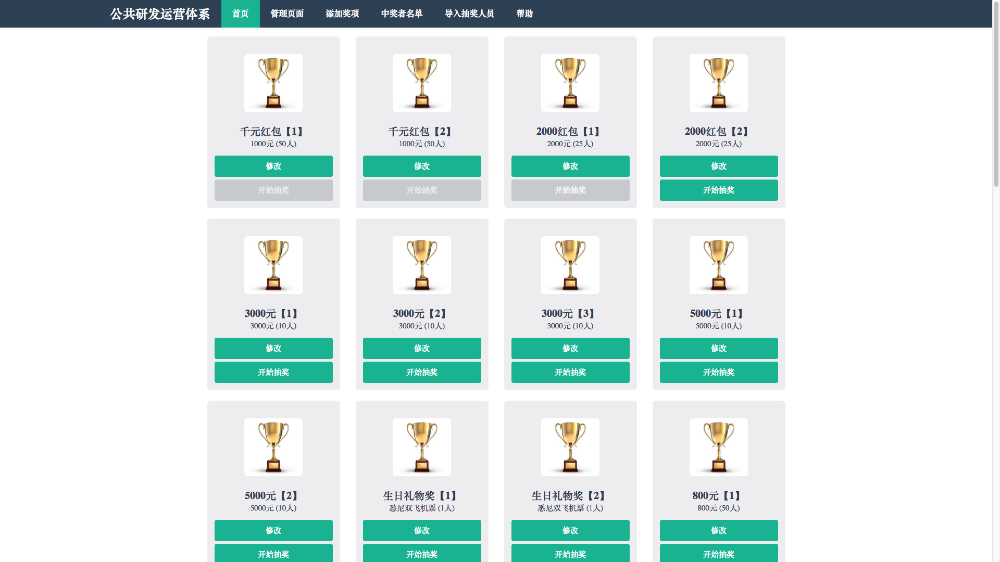

<h2 id="21-%E6%B7%BB%E5%8A%A0%E8%AE%BE%E7%BD%AE-%E6%8A%BD%E5%A5%96%E8%AE%A1%E5%88%92-a-hrefplan%E3%80%90how%E3%80%91a">
    2.1. 添加/设置 抽奖计划 <a href="#plan">【how】</a></h2>
<ul>
    <li>用户可自行添加抽奖计划，每个奖项属于单个抽奖计划</li>
    <li>每个抽奖计划有两种状态: 激活和未激活，只有属于激活抽奖计划的奖项可进行抽奖</li>
</ul>
<h2 id="22-%E6%B7%BB%E5%8A%A0%E8%AE%BE%E7%BD%AE-%E5%A5%96%E9%A1%B9-a-hrefaward%E3%80%90how%E3%80%91a">2.2. 添加/设置 奖项 <a
        href="#award">【how】</a></h2>
<ul>
    <li>每个奖项可设置两个中奖名单，每个中奖名单各自可设置中奖人数</li>
    <li>可为每个人员指定不可参与某个奖项的抽取</li>
    <li>可设置中奖奖品为现场输入</li>
</ul>
<h2 id="23-%E6%9F%A5%E7%9C%8B%E5%AF%BC%E5%87%BA-%E6%89%80%E6%9C%89%E4%B8%AD%E5%A5%96%E8%80%85%08%E5%90%8D%E5%8D%95-a-hrefexport%E3%80%90how%E3%80%91a">
    2.3. 查看/导出 所有中奖者名单 <a href="#export">【how】</a></h2>
<h1 id="3-%E5%B9%B4%E4%BC%9A%E6%8A%BD%E5%A5%96app%E4%BD%BF%E7%94%A8%E8%AF%B4%E6%98%8E">3. 年会抽奖app使用说明</h1>
<h2 id="31-%E5%88%9D%E5%A7%8B%E9%A1%B5%E9%9D%A2">3.1. 初始页面</h2>

实际上，如果没有激活任何方案的情况下，这个页面为空。
<h2 id="32-%E5%AF%BC%E5%85%A5%E4%B8%AD%E5%A5%96%E5%80%99%E9%80%89%E4%BA%BA%E5%90%8D%E5%8D%95%EF%BC%8C%E6%B7%BB%E5%8A%A0%E6%8A%BD%E5%A5%96%E5%A5%96%E9%A1%B9">
    3.2. 导入中奖候选人名单，添加抽奖奖项</h2>
<ul>
    <li>
        
步骤1. 制作中奖候选人名单
        
用execl制作人员名单，格式如图

        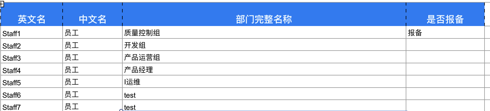
        
表单分为3列，分别是
            <remark>工号或者其他唯一名称（这里必须唯一，名单不可重复）</remark>
            ，
            <remark>中文名</remark>
            ，
            <remark>部门信息</remark>
            ，
            <remark>是否报备（报备的人员无法参与现场大奖）</remark>
        

        
如果报备的人需要参与到全员抽奖中，请在管理员页面的<a href="${SITE_URL}admin/lottery/exclusionforall/" target="_blank">排出名单forAll</a>提前清空掉
        

    </li>
    <li>
        
步骤2. 导入中奖候选者名单

        <ol>
            <li>点击首页 <code>导入抽奖人员</code>
            
             </li>
            <li>点击<code>choose file</code>选择上一步制作的人员名单
                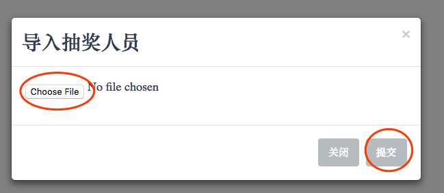</li>
            <li>点击<code>提交</code>完成文件上传</li>
        </ol>
    </li>
    <li>
        
步骤3. 导入中奖候选者头像

        <ul>
            <li>将候选者头像的图片名命名为名单中的 {英文名}.png</li>
            <li>复制图片到文件夹 {项目根目录}/static/avatars/ ,如下图的rtx1.png rtx2.png ...,
                如果名单中的候选者没有对应的头像图片，则后续的抽奖页面出现的头像为该文件夹下的default.png
                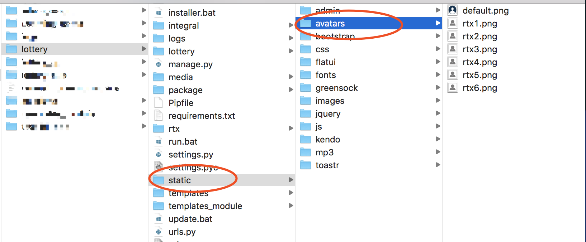</li>
            <li>
                    
可分别加入高清照片(用于中奖者头像展示)和低清图片(用于抽奖动画展示)，其中低清图片命名规则为{英文名}\_small.png

            </li>
        </ul>
    </li>
</ul>

<ul>
<li>

步骤4. 添加抽奖计划

<ul>
<li>之后添加每个的奖项都会属于这里添加的某个抽奖计划</li>
<li>所有抽奖计划都有<remark>激活</remark>和<remark>未激活</remark>两种状态，在任一时刻只能有一种抽奖计划处于激活状态</li>
</ul>
<ol>
<li>

点击首页 <code>管理页面</code>

</li>
<li>

第一次进入管理页面会要求输入管理员账号和密码，初始管理员账号: 
Username: admin 
Password: admin 
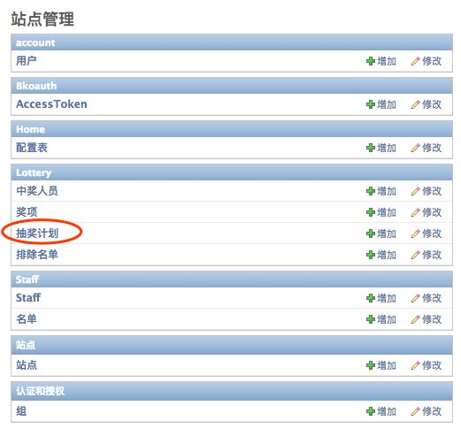

</li>
<li>

点击<code>抽奖计划</code>
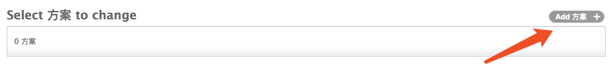
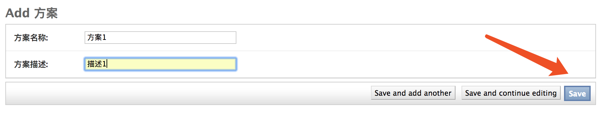
输入 <em>抽奖计划名称</em> 和 <em>抽奖计划描述</em>, 这里的 <em>抽奖计划名称</em> 和 <em>抽奖计划描述</em> 没有特殊含义可自定义，仅作为后面添加奖项的分类类别，最后点击保存<code>save</code>按钮

</li>
<li>

激活所创建的抽奖计划
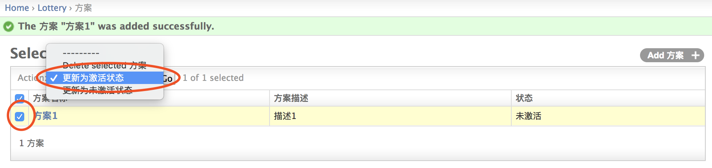
如上图所示，然后点击<code>go</code>按钮，激活所选抽奖计划

</li>
<li>

点击<code>View site</code>回到首页
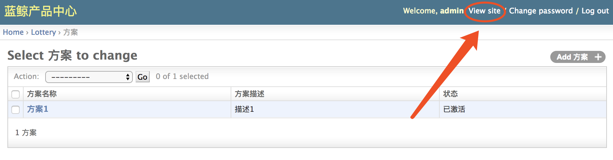

</li>
</ol>
</li>
</ul>

<ul>
<li>

步骤5. 添加奖项

<ol>
<li>点击首页<code>添加奖项</code>
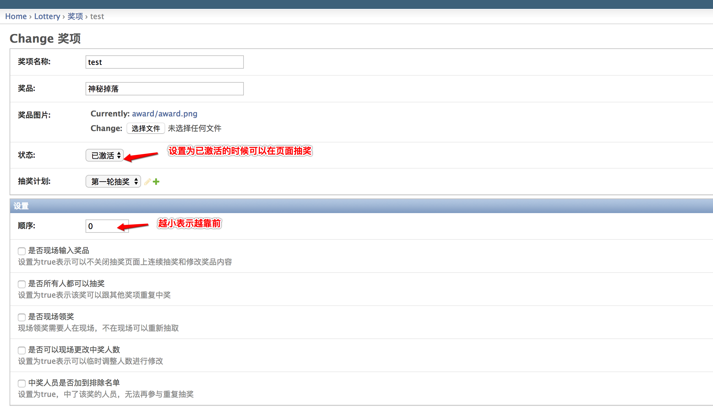
<ul>
<li>状态栏选择<code>已激活</code>, 否则无法在首页抽奖</li>
<li><code>是否现场输入奖品</code>: 如果事先不确定奖品是什么内容，譬如嘉宾赞助等抽奖项，则可以勾选此项，在抽奖页面可以直接现场输入奖品名称</li>
<li><caution>关联名单1和关联名单2必须选择两个不一样的名单</caution>，否则后面抽奖结果的动画不会正确展示</li>
</ul>
</li>
</ol>

<ol>按要求输入奖项各设置项后点击保存<code>save</code>按钮，页面自动跳转到首页
    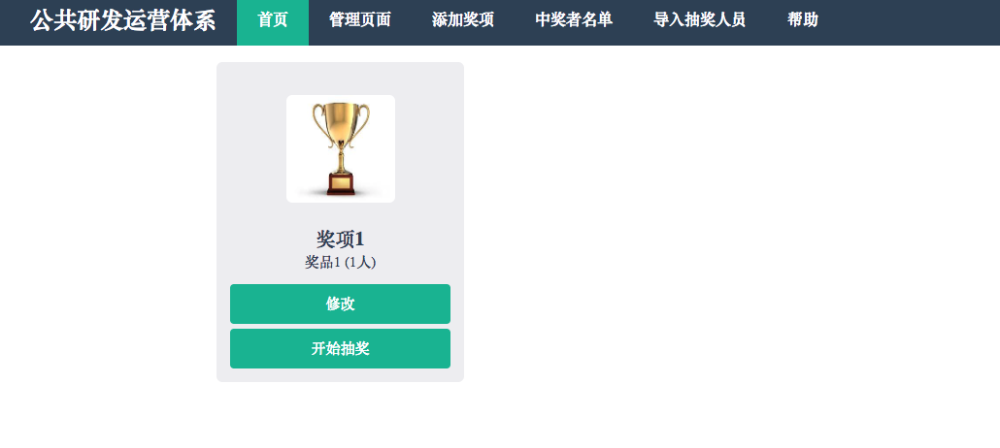</ol>

</li>
</ul>
<h2 id="33-%E6%8A%BD%E5%A5%96">3.3. 抽奖</h2>
<ol>
<li>选中想要抽奖的奖项，点击<code>开始抽奖</code>
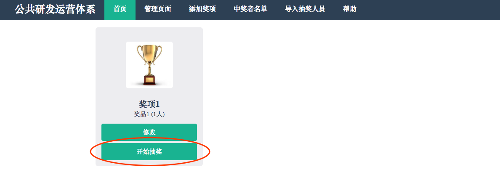</li>
<li>点击开始按钮
</li>
<li>点击停止按钮出现中奖结果页面

</li>
    <li>设置了 必须现场领奖，如果当前员工不在现场需要重新抽取，可以按照如下方法
        </li>
</ol>

<h2 id="34-%E6%9F%A5%E7%9C%8B%E5%AF%BC%E5%87%BA-%E4%B8%AD%E5%A5%96%E8%80%85%E5%90%8D%E5%8D%95">3.4. 查看/导出 中奖者名单</h2>

点击首页 <code>中奖者名单</code>
点击 <code>导出excel</code> 可导出中奖名单excel表

<h2 id="35-%E8%AE%BE%E7%BD%AE%E5%8D%95%E4%B8%AA%E5%A5%96%E9%A1%B9%E4%B8%AD%E5%A5%96%E6%8E%92%E9%99%A4%E4%BA%BA%E5%91%98%E5%90%8D%E5%8D%95">3.5. 设置单个奖项中奖排除人员名单</h2>
<blockquote>

设置排除名单可以将指定的人员排除在指定奖项的中奖候选人名单之外

</blockquote>
<ul>
    <ol>
<li>如图设置
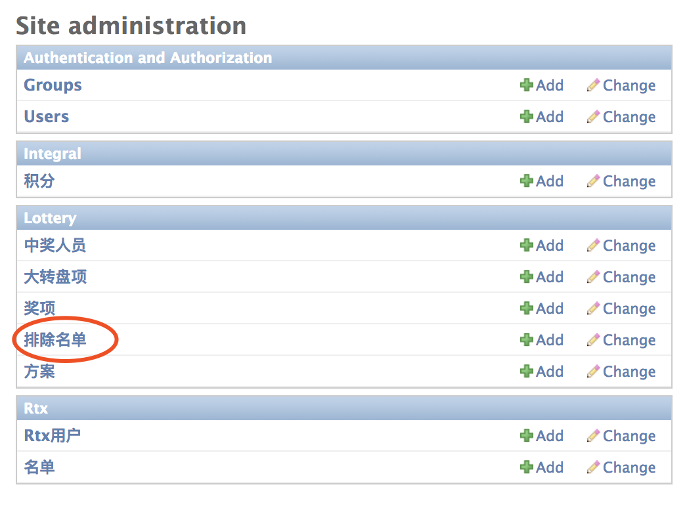
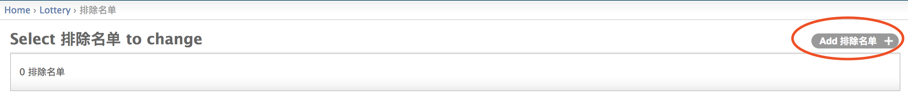
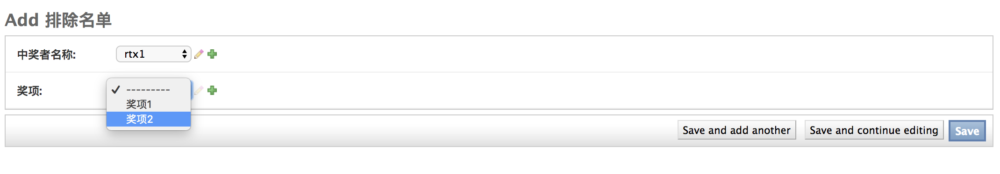</li>
    </ol>
</ul>
<h1 id="4-%E5%85%B6%E4%BB%96%E8%AF%B4%E6%98%8E">4. 其他说明</h1>
<h2 id="41-%E6%8A%BD%E5%A5%96%E9%80%BB%E8%BE%91">4.1. 抽奖逻辑</h2>

从该奖项设置中的中奖名单中<strong>除去已经中过奖的人和排除名单后</strong>，随机抽取每个名单对应的中奖人数

<h2 id="42-%E5%A5%96%E9%A1%B9%08%08%E5%8F%AF%E4%B8%AD%E5%A5%96%E4%BA%BA%E6%95%B0%E8%AE%BE%E7%BD%AE">4.2. 奖项可中奖人数设置</h2>

不能超过该奖项剩余中奖候选人总数

</body>
</html>
